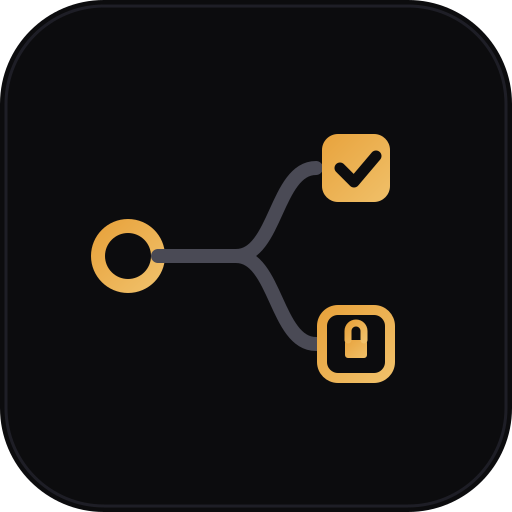
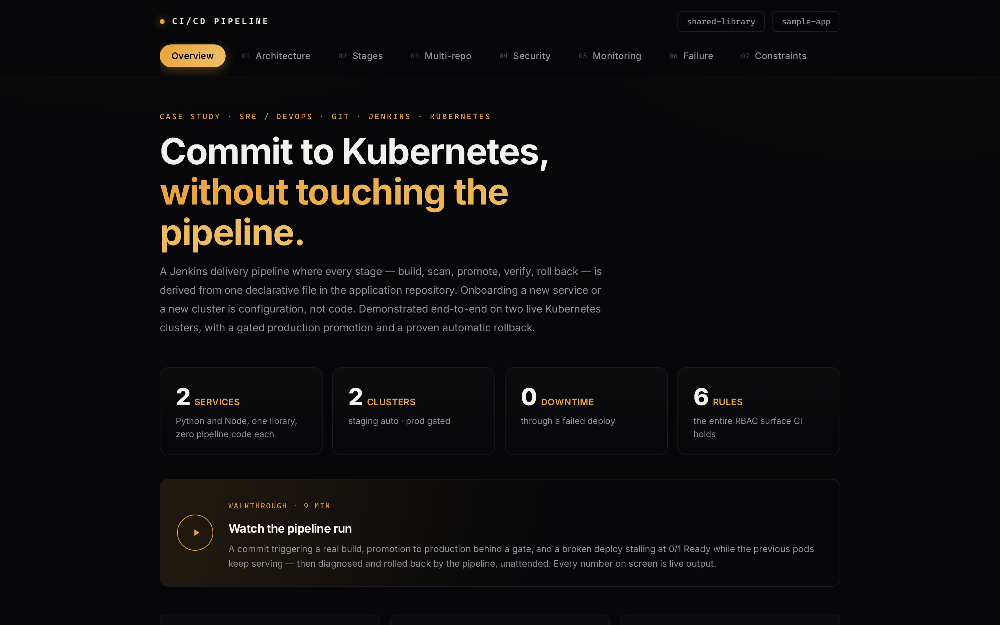

<div align="center">



# CI/CD Pipeline — Orders API

### A Node service that exists to **attack a claim**. The library said it was repository-agnostic. This proved it wasn't — and found a real defect.

[](LICENSE)
[](#tech-stack)
[](#tests)
[](#the-point-of-this-repository)
[](#the-point-of-this-repository)
[](#security)

[](#tech-stack)
[](#tech-stack)
[](#tech-stack)
[](#tech-stack)
[](https://github.com/ayushgupta07xx/cicd-pipeline-shared-library)
[](#observability)

<br/>

[](https://youtu.be/8HLydMg_BCg)

📘 **[Read the case study](https://ayushgupta07xx.github.io/cicd-pipeline-sample-app/)** · ⚙️ **[Shared Library](https://github.com/ayushgupta07xx/cicd-pipeline-shared-library)** · 🐍 **[Sample App](https://github.com/ayushgupta07xx/cicd-pipeline-sample-app)** · 🏗 **[Platform](https://github.com/ayushgupta07xx/cicd-pipeline-platform)**

</div>

---

## The case study

A walkthrough of the design, the evidence behind every claim, and a constraints
section naming what this setup compromises and what production would do instead.

[](https://ayushgupta07xx.github.io/cicd-pipeline-sample-app/)

<div align="center">

**[→ Read the case study](https://ayushgupta07xx.github.io/cicd-pipeline-sample-app/)** ·
[Architecture](https://ayushgupta07xx.github.io/cicd-pipeline-sample-app/#architecture) ·
[Multi-repo](https://ayushgupta07xx.github.io/cicd-pipeline-sample-app/#multirepo) ·
[Security](https://ayushgupta07xx.github.io/cicd-pipeline-sample-app/#security) ·
[Failure handling](https://ayushgupta07xx.github.io/cicd-pipeline-sample-app/#failure) ·
[Constraints](https://ayushgupta07xx.github.io/cicd-pipeline-sample-app/#constraints)

</div>


## The point of this repository

A pipeline that claims to be **adaptable to different Git repositories** is worthless until a genuinely different repository tests it. So this service was built to be unlike its sibling in every dimension the library might have quietly assumed:

| | [Sample App](https://github.com/ayushgupta07xx/cicd-pipeline-sample-app) | **Orders API** |
|---|---|---|
| Language | Python / Flask | **Node / Express** |
| Port | 8080 | **3000** |
| Replicas | 2 | **1** |
| Test runner | pytest | **`node:test`** |
| Smoke path | `/health` | **`/api/orders`** |
| Container UID | 10001 | **1000** |
| Image repo | `finacplus/sample-app` | `finacplus/orders-api` |

Onboarding took two files — a three-line `Jenkinsfile` and a `deploy-config.yaml`.

**And one fix to the library.** The Test stage had hardcoded a Python image and `pip install`, so `npm test` ran inside `python:3.12-slim` and failed:

```
+ docker run --rm --volumes-from c5de9da8ad28 -w /var/jenkins_home/jobs/orders-api/workspace
  python:3.12-slim sh -c pip install -q -r requirements.txt pytest && npm test
ERROR: Could not open requirements file: 'requirements.txt'
```

The library was **never** language-agnostic — it had only ever been asked to run Python. The test runtime now lives in each repository's config:

```yaml
test:
  image: "node:22-slim"
  setup: "npm install --no-audit --no-fund"
  commands: ["npm test"]
```

…with a validation rule that rejects a config omitting it, and a **unit test in the library** that fails if anyone reintroduces the assumption.

That defect was only discoverable by onboarding a genuinely different service. A single-repository submission would have shipped it — and the first person to ask *"what happens with a Node service?"* would have found it instead.

## Endpoints

| Path | Purpose |
|---|---|
| `/health` | **Liveness** — is the process alive |
| `/ready` | **Readiness** — should it receive traffic |
| `/api/orders` | Business endpoint — and the smoke-test target |
| `/api/build-info` | Build and runtime identity as JSON |
| `/metrics` | Prometheus exposition, including `app_build_info` |

The smoke test hits `/api/orders`, not `/health`, deliberately: verifying a *business* endpoint proves more than verifying the probe the rollout already checked.

## Observability

Instrumented independently of its sibling, with **identical label sets** — because inconsistent instrumentation is what makes cross-service dashboards impossible:

```
app_build_info{service="orders-api", build_number="5", commit="09f1f18",
               branch="main", version="1.2.0",
               environment="staging", cluster="kind-staging"} 1
```

`prom-client` provides default Node metrics, an HTTP request counter, a latency histogram, and that build-identity gauge. Three pod annotations and Prometheus finds it — **no monitoring config change**.

## Security

Runs as **UID 1000**, read-only root filesystem, all capabilities dropped, no ServiceAccount token mounted.

Trivy reported **3 HIGH** vulnerabilities in `node:22-slim` — the build was marked **UNSTABLE** and continued, exactly as configured, while its Python sibling scanned clean:

```
Total: 3 (HIGH: 3, CRITICAL: 0)
WARNING: Trivy found HIGH,CRITICAL vulnerabilities — reported, not blocking
```

That's a documented policy, not laziness. Base images carry unfixed CVEs, and a demo that fails unpredictably teaches nothing. `failOnFindings: true` is one line — what production wants, on a maintained base image, with an exception process.

## Run it locally

```bash
docker build -t orders-api:local .
docker run --rm -p 3099:3000 -e APP_ENV=local orders-api:local
curl -s localhost:3099/api/orders | jq
```

## Tests

```bash
docker run --rm -v "$(pwd)":/w -w /w node:22-slim \
  sh -c 'npm install --no-audit --no-fund && npm test'
```

Five tests via Node's built-in runner — no test framework dependency. `/health`, `/ready`, the `/api/build-info` contract, `/metrics` exposition format, and the orders endpoint.

## Tech stack

| Layer | Tools |
|---|---|
| Service | Node 22 · Express 4 |
| Metrics | `prom-client` — default metrics, request counter, latency histogram, build gauge |
| Container | `node:22-slim` pinned · non-root UID 1000 · read-only rootfs · OCI labels |
| Kubernetes | `${VAR}`-templated manifests · `maxUnavailable: 0` · separate probes · resource limits |
| Testing | `node:test` (built-in) |

## Repo layout

```
src/
  app.js              Express app — endpoints, metrics, build identity
  server.js           listener
k8s/deployment.yaml   Deployment · Service · ServiceAccount (templated)
test/app.test.js      5 tests
Jenkinsfile           3 lines — identical to sample-app's
deploy-config.yaml    the entire integration with the pipeline
```

## Honest limitations

- **The orders data is static.** This service exists to test the pipeline's repository-agnosticism, not to be a real orders API.
- **`node:22-slim` carries 3 HIGH CVEs.** Reported, not blocking, by explicit policy — see above.

## License

Code under **Apache 2.0** — see [`LICENSE`](LICENSE).

---

<div align="center">

Built by **Ayush Gupta** · [GitHub](https://github.com/ayushgupta07xx) · [LinkedIn](https://www.linkedin.com/in/ayush-gupta-544a803a2)

</div>
